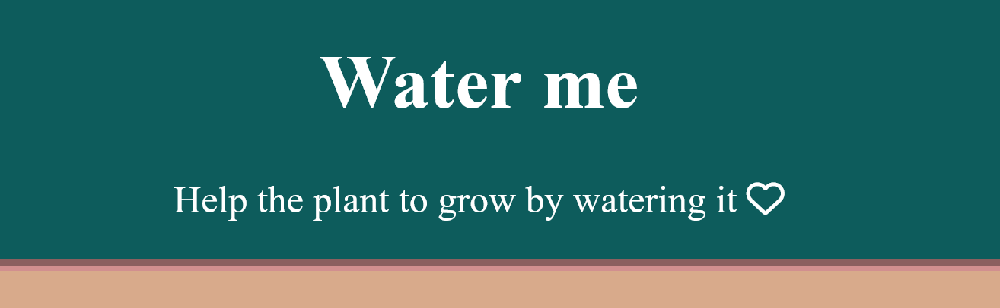

# 🌸 Water me 🌸
[originally made 3/2024, small updates 11/2024]
[comment 11/2024: nowadays I would not approach things like this
with this structure but it worked then... 😊]

This small game is about: 
- how to drag things to spesific containers and make it change
(made with pictures)
- how to add and toggle
- create and append elements in JS
- how to use Font Awesome
- styling
- to test pixel sprites

🌸 Here is the link to play the game:
https://kaunfell.github.io/Water-me/

